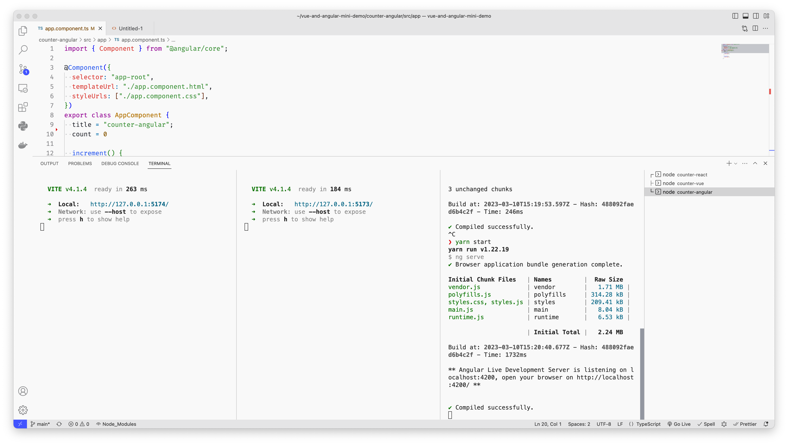

# React/Vue/Angular Demo of the Counter App

The React and Vue apps are created with Vite.

---

The code.

---

The dev server.

---

The React app network tab in the browser console.

---

The Vue app network tab in the browser console.

---

The Angular app network tab in the browser console.

---

The disk space used.

